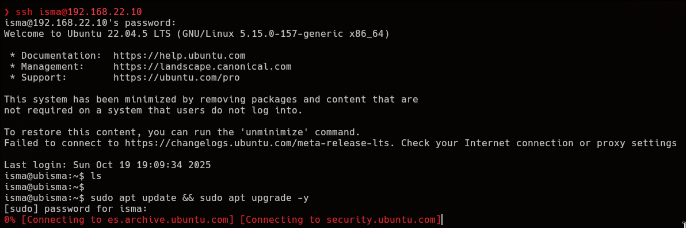
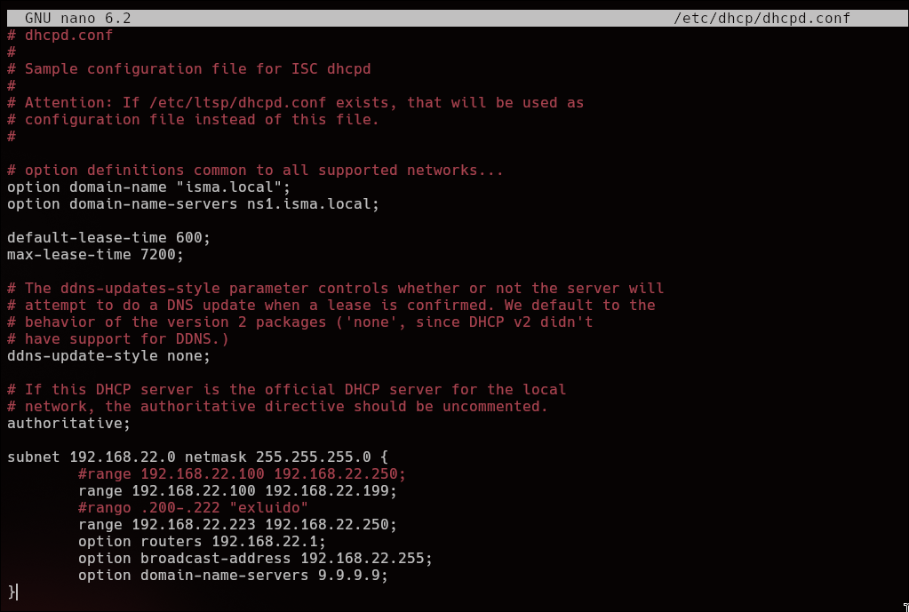
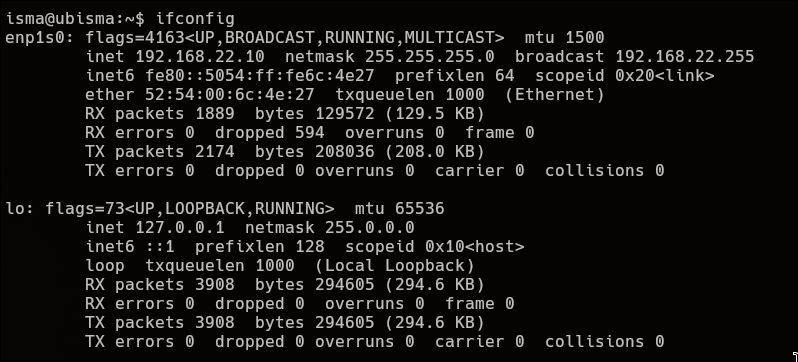
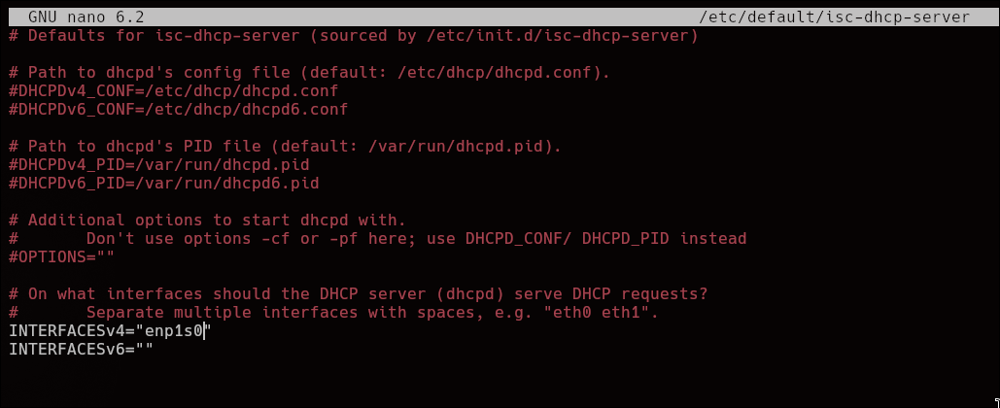
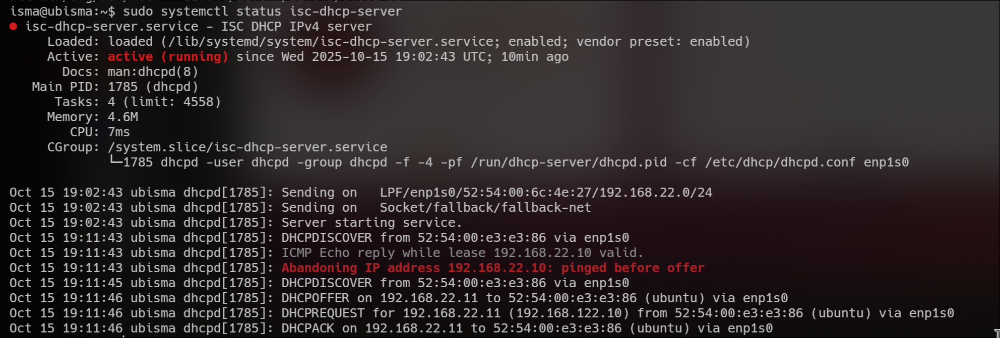
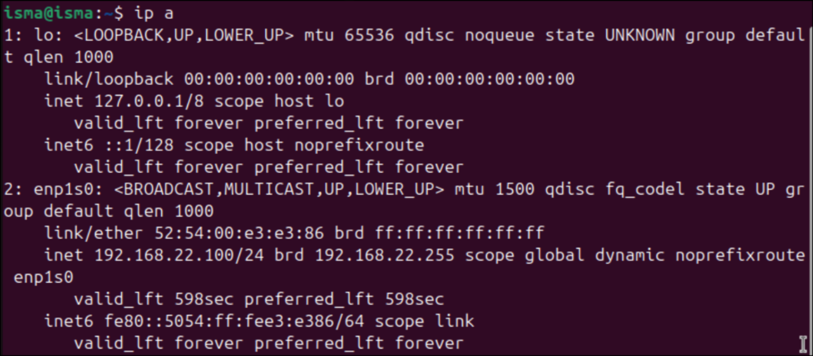

# Instalando Servidor DHCP
Una vez entendemos como funciona el protocolo DHCP, vamos a configurar un servidor DHCP.
Primero necesitamos como base, de sistema operativo Ubuntu Server con openssh-server instalado. Una vez lo tenemos nos conectamos por ssh y empezamos por actualizar el sistema.

```bash
sudo apt update && sudo apt upgrade -y
```


Una vez se actualicen los repositorios y los paquetes pasamos a instalar el servicio **DHCP**:

```bash
sudo apt install isc-dhcp-server -y
```


# Configurando Servidor DHCP

Una vez instalado, pasamos a la configuración de nuestro pool, en este caso la creamos sobre estos rangos:

| IP de red      | 192.168.22.0                                              |
| -------------- | --------------------------------------------------------- |
| Rango de ip    | 192.168.22.100 - 250                                      |
| Mascara de red | 255.255.255.0                                             |
| Gateway        | 192.168.22.1                                              |
| Servidores DNS | 192.168.22.10 (aunque posteriormente la cambio a 9.9.9.9) |
esto se ve reflejado de la siguiente manera:

```bash
subnet 192.168.22.0 netmask 255.255.255.0 { #Mascara e IP de red
        range 192.168.22.100 192.168.22.250; #rango del pool DHCP
        option routers 192.168.22.1; #Gateway
        option broadcast-address 192.168.22.255; #Direccion Broadcast de la red
        option domain-name-servers 9.9.9.9; #Servidores DNS
}
```

Después des comentamos la línea donde pone `#authorative`. Seguidamente definimos el **nombre de dominio** local que recibirán los equipos del cliente DHCP junto al **tiempo por defecto** (en segundos) durante el cual un cliente puede usar la IP antes de tener que renovarla.

```bash
option domain-name "isma.local"; #Dominio local
option domain-name-servers ns1.isma.local; #dns

default-lease-time 600; #tiempo minimo de uso IP
max-lease-time 7200; #Tiempo maximo de uso IP
```

Por lo que el archivo de configuración quedaría de la siguiente manera



Una vez configurado debemos decirle al servicio DHCP en que puerto debe escuchar, en mi caso es `enp1s0`.  Para poder verificarlo simplemente hacemos un `ipconfig` y verificamos como se llama nuestro puerto:

```bash
ipconfig
```

nos dará  un output como este:



Y el archivo de config de los puertos quedara así:



Una vez configurado, simplemente reiniciamos el servicio DHCP y si tenemos algún cliente ya en la misma red, debería darle ip como en la siguiente imagen:

```bash
sudo systemctl restart isc-dhcp-server
```



Si hacemos un ip a en nuestro cliente, vemos como coincide la dirección ip con la de los logs del servidor.


