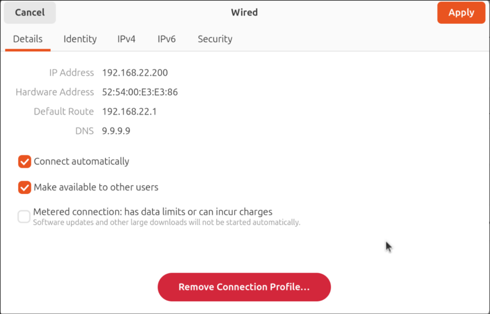
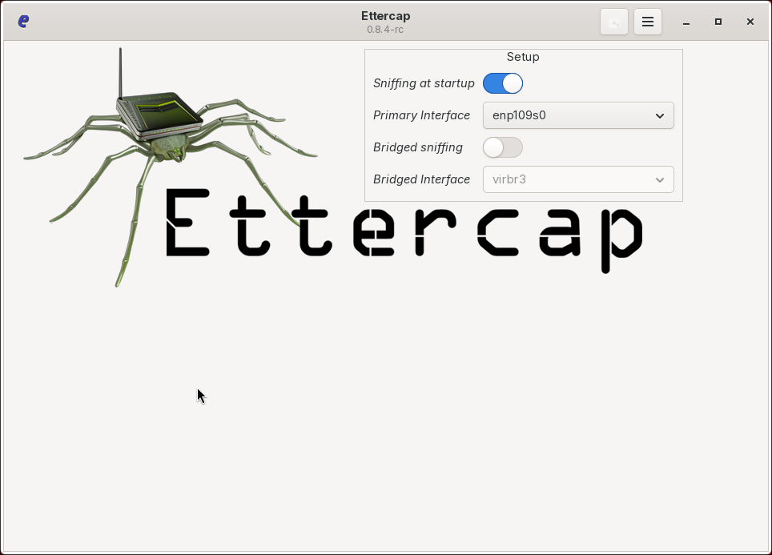
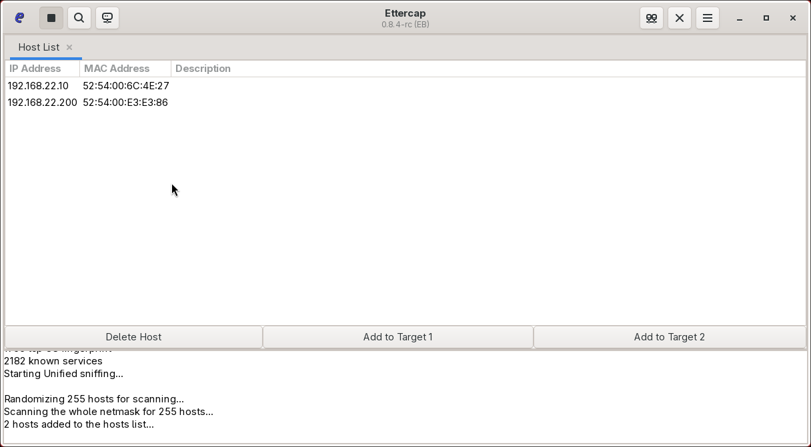
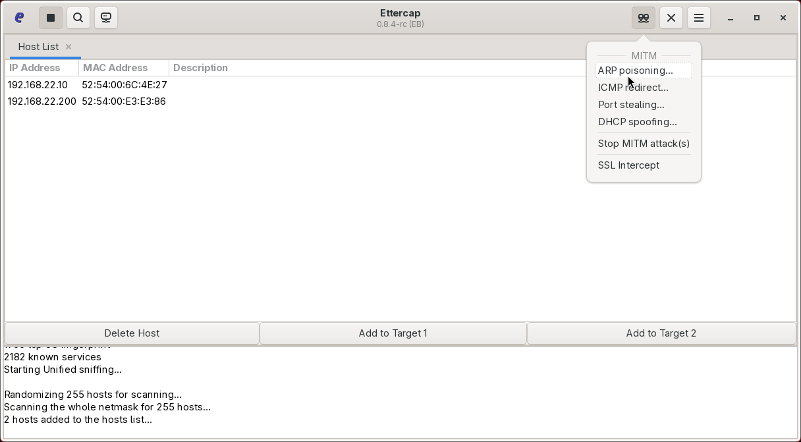
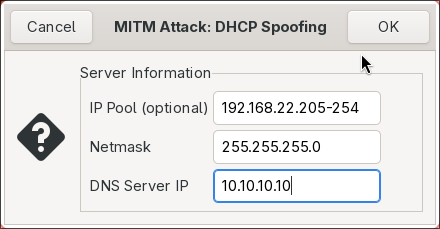
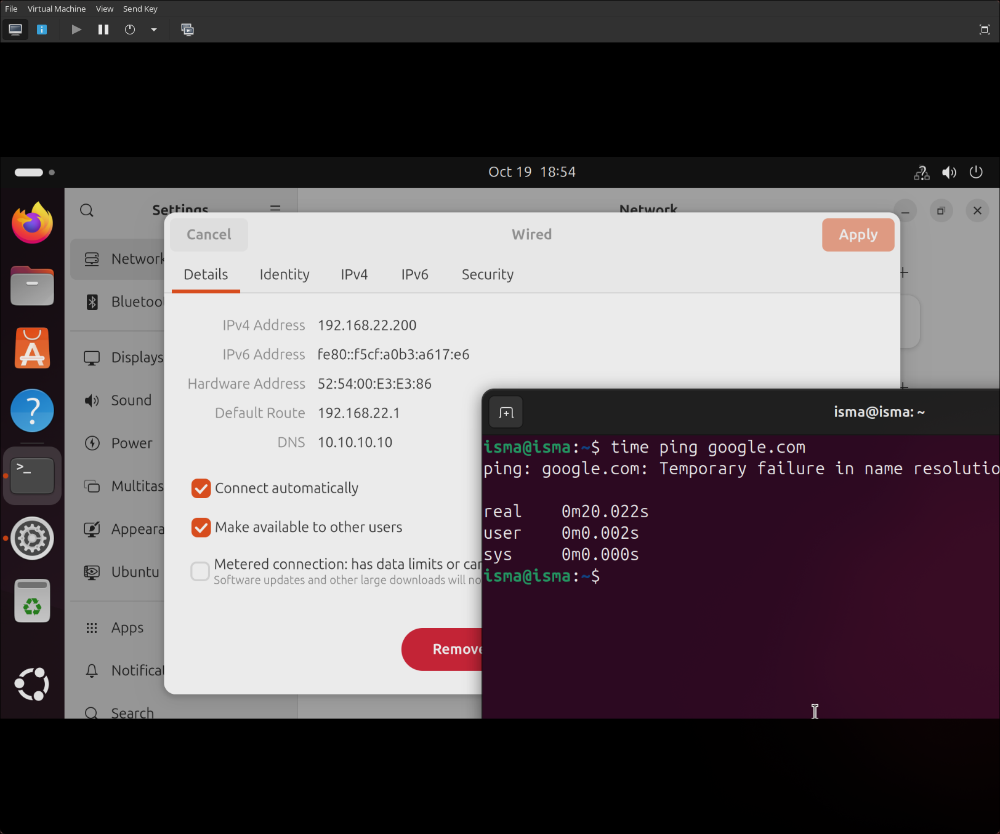

Una vez nos hemos divertido ahogando al servidor **DHCP** de peticiones, vamos a “suplantarlo” y de esta manera potencialmente redirigir peticiones a nuestro servidor malicioso. En este caso nuestro servidor **DHCP** dentro de los parametros de red, como DNS da la “9.9.9.9”.

Para poder modificar el DNS (también podríamos modificar cosas como la mascara, etc.), utilizaremos una herramienta llamada “Ettercap”. 

Ettercap es una herramienta para ataques MITM, un ataque MITM o Man In The Middle, como bien dice su nombre, es un ataque donde nos ponemos en la red como intermediarios entre el router/switch y el equipo para poder interceptar y/o modificar conexiones. Como ejemplos de ataques tenemos del protocolo DHCP (DHCP spoofing),  ARP (ARP poisoning), etc. 

Una vez entendemos la herramienta, la iniciamos y al iniciarla se pone a “esnifar” la red en busca de hosts, y en este caso encuentra al servidor DHCP (.10) y la (.200) que es el equipo cliente. Hacemos click en el botón de arriba la derecha, para escoger el ataque.

En este caso escogemos DHCP Spoofing

Configuramos los parametros de la pool DHCP.

Ahora podemos ver como al pedir una nueva ip, nos da como DNS el que hemos seteado 10.10.10.10.

Al intentar hacer ping a google.com no llegamos ya que ese dns no existe, lo cual , de nuevo, es un indicador del éxito del PoC. Para poder evitar este ataque -- 
