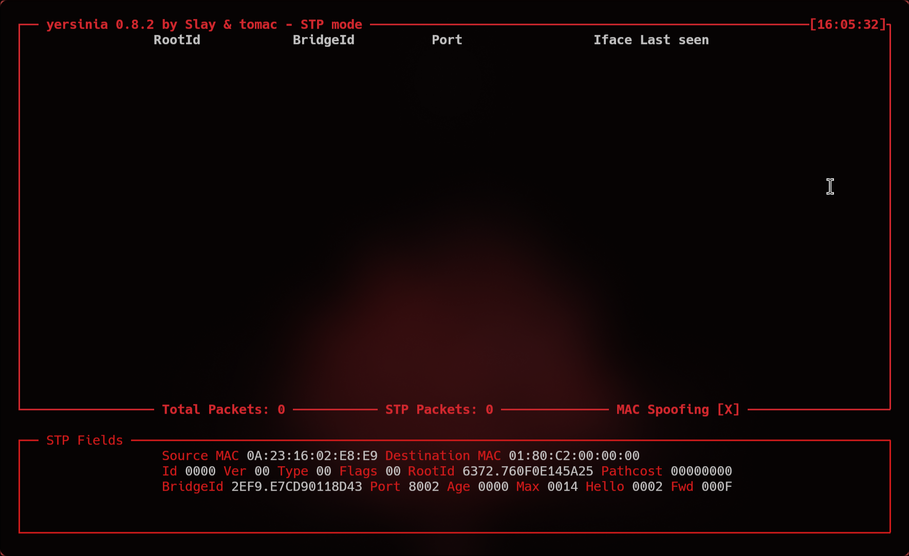
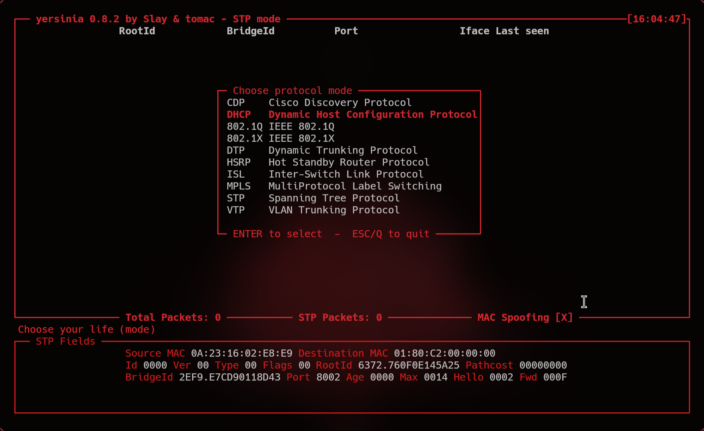
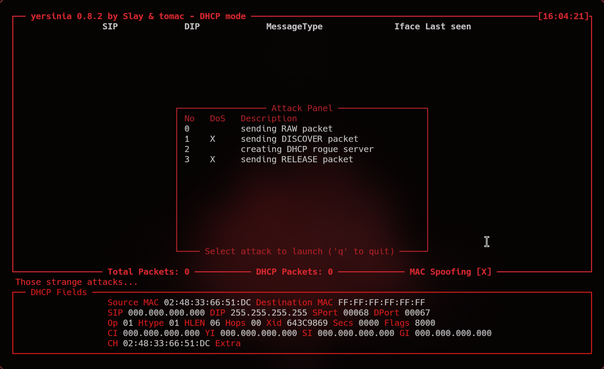
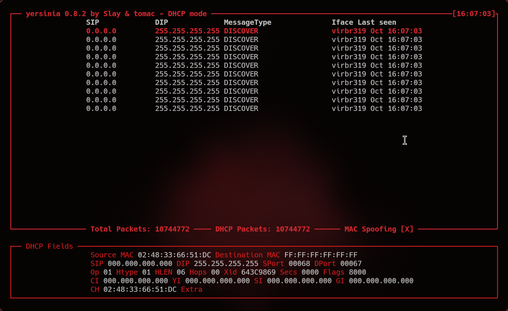
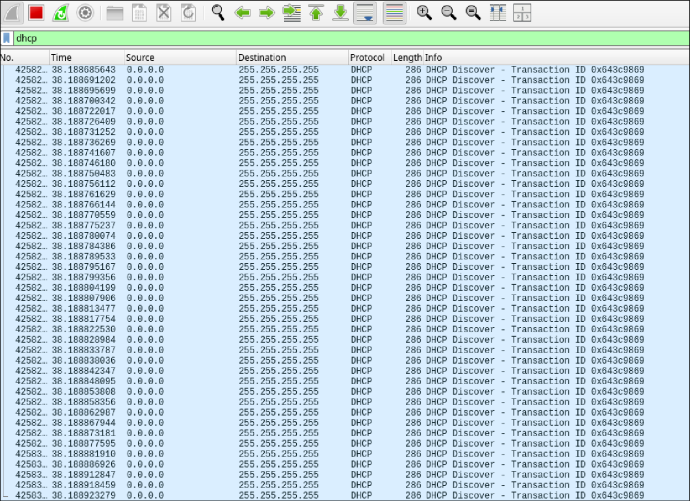
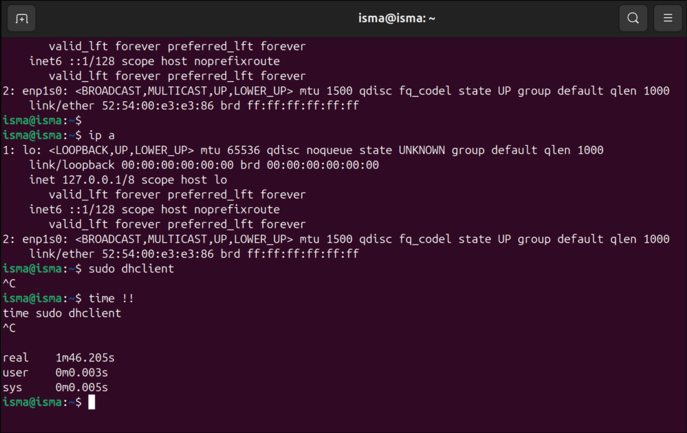
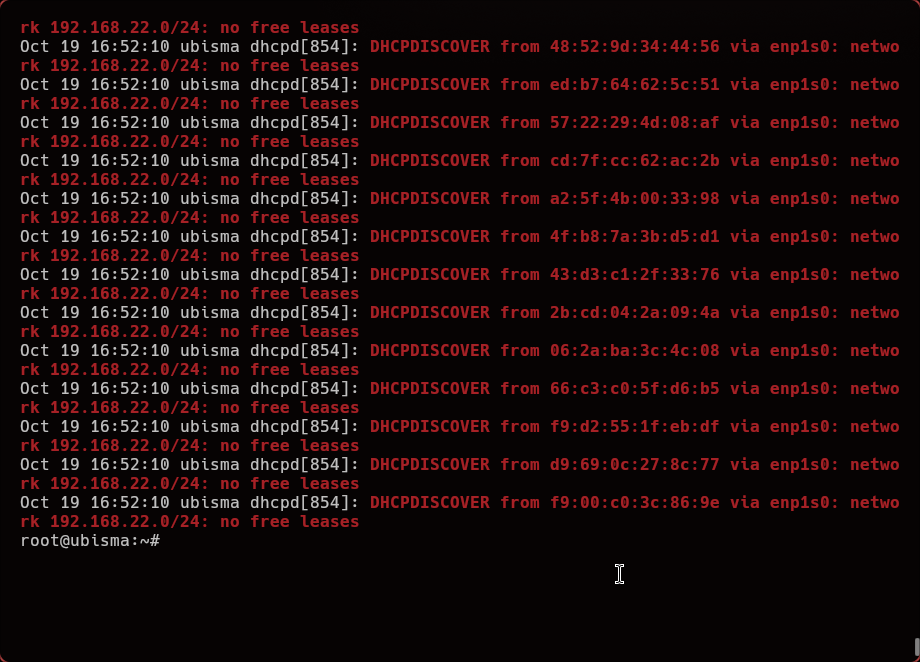

Nos referimos a la "**DHCP Starvation Attack Replication**" (**replicación de un ataque DHCP Starvation**) cuando un atacante genera un gran número de solicitudes DHCP falsas para agotar el pool de direcciones IP disponibles, impidiendo que los clientes legítimos obtengan configuración y dejando la red expuesta a otros ataques posteriores.
 Para poder replicar este ataque en un laboratorio (entorno seguro) Utilizaremos lo siguiente:
- Máquina atacante: Kali Linux
- Cliente DHCP: Ubuntu Desktop
- Servidor DHCP: [Ubuntu Server](../ConfigurandoServidorDHCP.md)

Para poder realizar el ataque utilizaremos una herramienta llamada **Yersinia**, esta es una herramienta diseñada para ejecutar ataques sobre protocolos de Capa 2 del modelo OSI. Aunque DHCP es un protocolo de capa de aplicación (funciona sobre UDP/IP), muchas de sus operaciones iniciales se realizan mediante broadcasts a nivel de enlace, por lo que Yersinia puede manipular las tramas Ethernet para llevar a cabo ataques relacionados con DHCP.

Una vez sabemos lo que es **Yersinia** y estamos en nuestra máquina atacante, vamos a instalar **y
Yersinia**.

```Bash
sudo apt install yersinia -y #Para SO basados en Debian
pacman -S yersinia #Para Arch, Manjaro, etc.
```

Una vez instalada la iniciamos en modo terminal interactiva:

```bash
sudo yersinia -I
```



Como podemos ver arriba a la izq estamos en "STP mode", para cambiar a DHCP tenemos que usar la tecla `g` para poder escoger entre diferentes protocolos:



Una vez cambiado hacemos click a la `x` para listar los ataques



Seleccionamos el `1` y vemos que en tan solo 10segundos ya ha enviado más de 1M de paquetes.



Si revisamos el trafico esnifando la red con wireshark encontramos lo siguiente: Un monton de paquetes **DHCPDISCOVER**



Esto hace que el cliente sea incapaz de recivir una IP




Despues de mas de 1:30 min el cliente sigue sin recibir ip. Lo cual es un indicador del éxito del PoC.
